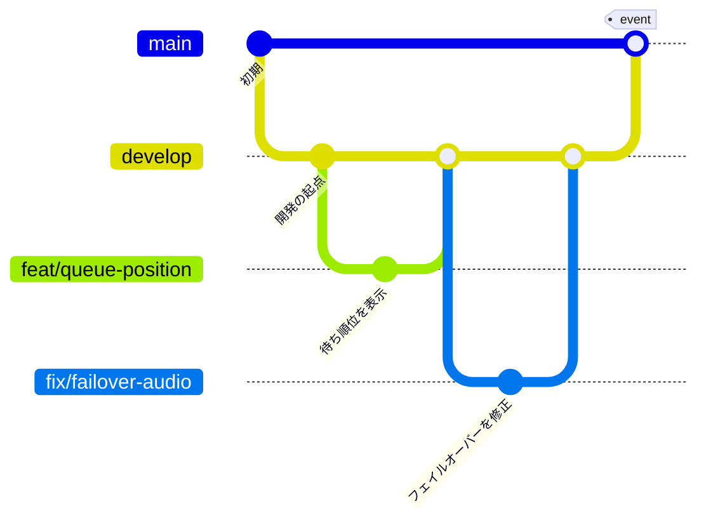

# コントリビューションガイド

コエコミ（`koekomi`）の開発ルールをまとめます。
セットアップや構成は [README.md](./README.md) と [`docs/`](./docs) を参照してください。

## コミットメッセージ

[Conventional Commits](https://www.conventionalcommits.org/) に準拠し、**説明は日本語**で書きます。

```
<type>: <変更内容を日本語で簡潔に>
```

例：

```
feat: 生成の待ち順位を劇場に表示する
fix: フェイルオーバー後に古い音声を参照する不具合を修正
docs: Colab Pro+ の停止手順を追記
```

### type 一覧

| type       | 用途                                           |
| ---------- | ---------------------------------------------- |
| `feat`     | 新機能                                         |
| `fix`      | バグ修正                                       |
| `docs`     | ドキュメントのみの変更                         |
| `style`    | 動作に影響しない変更（フォーマット・空白など） |
| `refactor` | バグ修正でも機能追加でもないコード改善         |
| `perf`     | パフォーマンス改善                             |
| `test`     | テストの追加・修正                             |
| `chore`    | ビルド・補助ツール・設定など                   |
| `ci`       | CI 関連の変更                                  |

### 書き方のポイント

- 件名は簡潔に（目安50文字以内）。末尾に句点（。）は付けない
- 1コミット＝1つの意味のある変更にまとめる
- 詳細が必要なら本文に「何を・なぜ」を書く
- 関連 Issue は本文に `Closes #123` のように書く

### コミットテンプレート（任意）

雛形を自動で表示したい場合は、リポジトリ直下で次を設定します。

```bash
git config commit.template .gitmessage
```

以降 `git commit`（`-m` なし）でエディタを開くと、type 一覧つきの雛形が表示されます。

## ブランチ運用

`main` + `develop` の2本を軸に運用します。

| ブランチ        | 役割                                                                   |
| --------------- | ---------------------------------------------------------------------- |
| `main`          | リリース版のみ。常に「イベントで使える状態」を保つ。直接コミットしない |
| `develop`       | 開発の統合先。作業ブランチはここから切り、ここに戻す                   |
| `<type>/<内容>` | 作業ブランチ。`develop` から切って `develop` へ PR                     |

### 流れ

1. `develop` から作業ブランチを切る
2. 作業して `develop` へ PR → マージ
3. リリースのタイミングで `develop` → `main` へ PR → マージ

```bash
git switch develop
git pull
git switch -c feat/queue-position   # develop から作業ブランチを作成
```

### フロー図



- 作業ブランチは `develop` から切り、`develop` へ戻す（PR）
- `main` へは、イベント前に `develop` をまとめてマージする

### 作業ブランチの命名

コミットの type に合わせると分かりやすいです。

```
<type>/<簡潔な内容>
```

例：

```
feat/queue-position
fix/failover-audio
```

## プルリクエスト

- 通常は `develop` に向けて作成します（イベント前のみ `develop` → `main`）
- テンプレート（概要・変更内容・確認）を埋めます
- CI（lint / format / 型 / テスト / E2E）が通ることを確認します
- 関連 Issue を `Closes #123` でリンクします

## Issue

タスク・バグ・要望は Issue で管理します。「New issue」から用途に合うテンプレート（タスク / バグ報告 / 機能要望）を選んでください。

---

## 開発コマンド

リポジトリ直下から、両スタックをまとめて回せます。

```bash
npm run check        # lint + format確認 + 型 + テスト（PR前にこれ）
npm run fix          # 自動修正（format + lint --fix）を両スタックに適用

npm run lint         # frontend + backend の lint
npm run format       # frontend + backend の整形
npm run format:check  # 整形されているかの確認（CI と同じ）
npm run typecheck    # frontend の型チェック
npm run test         # frontend + backend のテスト
```

バックエンドだけを触るときは:

```bash
cd backend
. .venv/bin/activate
pytest
ruff check . && ruff format .
```

## コードの決まりごと

### 層と依存の向き

バックエンドもフロントエンドも **domain / application / infrastructure / interface(ui)** の4層です。
**依存の向きは常に内向き**（`interface·ui → application → domain`）。

| 層                 | 置くもの                      | 禁止                                       |
| ------------------ | ----------------------------- | ------------------------------------------ |
| `domain`           | 型と純粋な計算                | 何も import しない（標準ライブラリのみ）   |
| `application`      | ユースケース                  | 具体的な実装を知らない。ポート越しに触る   |
| `infrastructure`   | HTTP・DB・ffmpeg・ブラウザAPI | 業務判断を持たない                         |
| `interface` / `ui` | 入出力の変換と表示            | `fetch` を直接呼ばない。業務判断を持たない |

- 具体実装を選ぶのは `backend/app/interface/container.py` **だけ**です。
- フロントの UI から `fetch` を直接呼ばないこと。ユースケースは `application/` に置きます。

### 守ってほしい4つの不変条件

崩すと3台構成が冗長化として機能しなくなります。変更時は特に注意してください。

1. **サーバーはステートレス。** 成果物はTTL付きの一時ファイルだけ。
2. **クライアントが作品の唯一の所有者。** 生成音声は完成した瞬間に IndexedDB へ落とす。
3. **作業単位は1行。** 重い処理を `asyncio.wait_for` で中断しようとしないこと
   （別スレッドの処理は外から止められず、「タイムアウトしたのにGPUでは走り続けて二重実行」になります）。
4. **ドメインに絶対URLを持ち込まない。** 音声は `AudioRef`（IndexedDBのキー）で参照します。
   URLはトランスポートのアドレスであり、サーバーが変わると無効になるためです。

### UI

- 表示は**漢字＋ふりがな**（小学生向け）。`Ruby` コンポーネントを使います。
- エラーの詳細（HTTPコード等）は画面に出さず、`console.error` に残します。
- 秘密情報（トークン・URL）は**コードに直書きしない**。環境変数（Colab はシークレット）から読みます。

## テストの書き方

**正常系だけでなく、壊れ方をテストしてください。** このアプリの価値は
「イベント中に何かが落ちても子どもの体験が止まらないこと」なので、
そこが動く保証こそがテストの目的です。

書いてほしいもの:

- 障害パス（サーバーが落ちる / 声の期限切れ / 部分失敗 / 通信断）
- 壊れた保存データを読んでも開けること
- 境界（0件・上限・空文字・不正な入力）

テスト名は**日本語で「何が保証されるか」**を書きます。

```ts
it('16行中1行失敗しても、残りは使える', () => { … })
it('リセット後の行IDが元と衝突しない（古い音声を拾わない）', () => { … })
```

「なぜこのテストがあるのか」が自明でない場合は、docstring / コメントに
**過去に壊れた経緯**を残してください（例: `test_render.py` の尺のテスト）。
