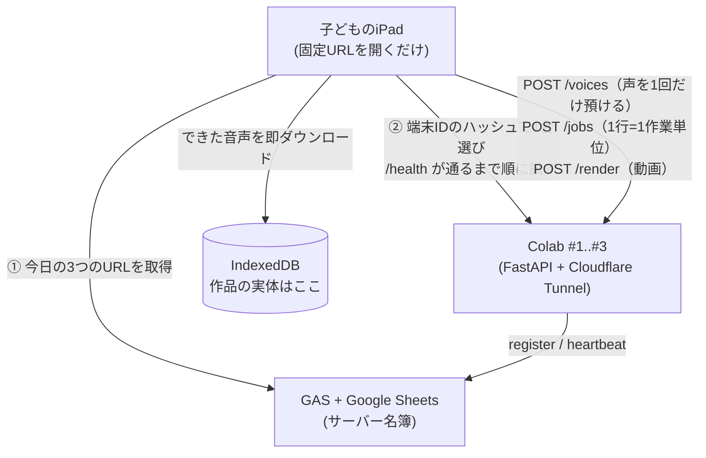
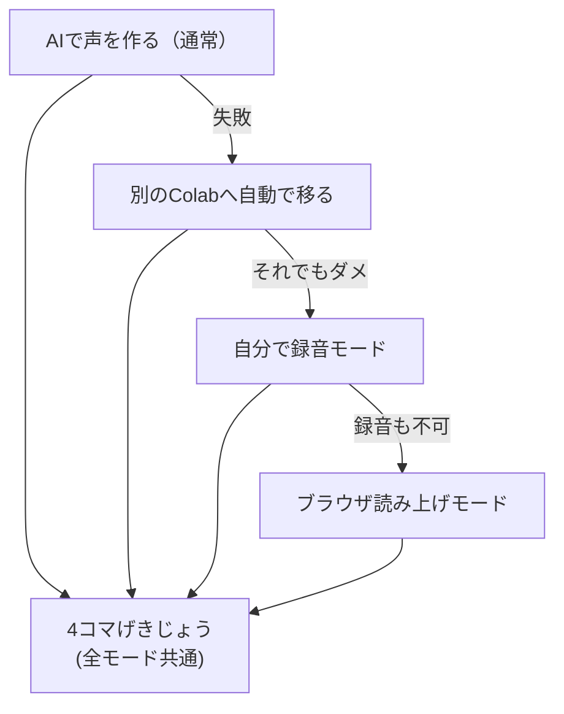

# コエコミ — 声でつくる4コマ劇場

小学生向けイベント用 Web アプリ。
iPad でアプリを開き、**決まった文を読んで自分の声を録音 → 4コマ漫画を作る → AI音声を生成 → 4コマ劇場として再生・動画で保存**するまでを行えます。
画面は**左サイドバーでいつでも自由に行き来**でき（順番の強制なし）、各コマには**写真1枚＋セリフを複数**置けます。UI はすべて**漢字＋ふりがな**で表示します。

規模: **同時 最大10人 / サーバー3台（Colab Pro+）**。

---

## アーキテクチャ



### 設計の柱（4つの不変条件）

この4つが崩れると、3台構成が冗長化として機能しなくなります。

1. **サーバーはステートレス。** 成果物はTTL付きの一時ファイルだけ。真実はクライアントにある。
2. **クライアントが作品の唯一の所有者。** 生成音声は完成した瞬間に IndexedDB へ落とす。
3. **作業単位は1行。** だから強制キャンセルが要らない（Pythonのスレッドは外から止められない）。
4. **UI層は絶対URLを持たない。** `artifactId` を持ち、URLへの解決は application 層だけが行う。

> **3台あるのは速さのためではなく、1台落ちても誰も気づかないためです。**
> 10人 × 16行 × T秒 ÷ 3台 という計算をすると、GPU は 95% 以上遊びます。
> だから負荷分散はしていません（＝共有状態が要らない）。散らすのは端末IDのハッシュ、
> 冗長化は `/health` のリトライ。どちらも通信ゼロで済みます。

---

## 構成（monorepo）

```
koekomi/
├── frontend/          React + TypeScript（Vite）。子ども用UI＋先生用 /admin
│   └── src/
│       ├── domain/         純粋TS。React も fetch も知らない
│       │   ├── work.ts         作品モデル（正規化・AudioRef）
│       │   └── timeline.ts     ★再生規則の唯一の正（再生・書き出し・レンダで共有）
│       ├── application/    ユースケース。React の外
│       │   ├── workStore.ts    作品と画面の状態
│       │   ├── connection.ts   ハッシュ分散＋フェイルオーバー
│       │   ├── voiceJobs.ts    声のエンロールと生成ジョブ
│       │   ├── videoExport.ts  サーバーレンダ／クライアント書き出しの選択
│       │   └── persistence.ts  ストアを購読して保存（ストアはこれを知らない）
│       ├── infrastructure/ HTTP・IndexedDB・MediaRecorder など外の世界
│       └── ui/             コンポーネント。infrastructure を import しない
├── backend/           FastAPI
│   └── app/
│       ├── domain/         純粋。models.py / timeline.py
│       ├── application/    ports.py / jobs.py（ワーカープール）/ voices.py / render.py
│       ├── infrastructure/ tts_qwen / tts_dummy / artifact_store / video_ffmpeg
│       └── interface/      FastAPI。container.py が唯一の組み立て場所
├── colab/             Colabでバックエンドを起動するコード
├── gas/               Google Apps Script（サーバー名簿）
└── scripts/           smoke-test.sh（当日朝の通し確認）ほか
```

依存の向きは常に内向き: `interface/ui → application → domain`。
`domain` は何も import しません。

---

## 1. 起動方法

### フロントエンド

```bash
npm install
cp frontend/.env.example frontend/.env   # VITE_GAS_URL / VITE_EVENT_TOKEN を設定
npm run dev            # http://localhost:5173
```

### バックエンド（ローカル開発）

```bash
cd backend
python3 -m venv .venv && . .venv/bin/activate
pip install -r requirements.txt
TTS_BACKEND=dummy uvicorn app.main:app --reload --host 0.0.0.0 --port 8000
```

`TTS_BACKEND=dummy` なら GPU 無しで全フローが動きます（AI音声＝トーン音）。
録音 → 生成 → 劇場再生 → 動画書き出しまで、ノートPC1台で最後まで確認できます。

---

## 2. API

すべて `X-Event-Token` ヘッダーが必要です（`/health` を除く。`/cleanup` だけは別枠 → 表の下）。
ヘッダーを付けられない経路（`<audio src>` / QRコード）のために `?t=` も受け付けます。

| メソッド | パス                | 用途                                                 |
| -------- | ------------------- | ---------------------------------------------------- |
| GET      | `/health`           | 生存確認。`status` が `warming` の間は割り当てない   |
| POST     | `/voices`           | 参照音声を**1回だけ**預けて `voiceId` をもらう       |
| DELETE   | `/voices/{id}`      | 声を忘れさせる（参照音声のファイルごと削除）         |
| POST     | `/jobs`             | 生成ジョブを積む。202 で即返る                       |
| GET      | `/jobs/{id}`        | 進み具合。1行できるごとに `results` が増える         |
| POST     | `/jobs/{id}/cancel` | 協調キャンセル（走っている1行は終わる）              |
| GET      | `/artifacts/{id}`   | 生成物の取得。uuid + TTL                             |
| POST     | `/artifacts`        | クライアント書き出しの動画を預ける                   |
| POST     | `/render`           | タイムラインから動画を作る                           |
| GET      | `/ops`              | 運用者向けの状態                                     |
| POST     | `/cleanup`          | 声も生成物もまとめて削除。**`X-Admin-Token` が必要** |

`/cleanup` だけは合言葉では通りません。合言葉はフロントのバンドルに載る
＝**参加者なら誰でも読める**ので、「全員分を消す」を守るには弱すぎます。
管理者トークンはフロントに配らず、運用者が手元から curl するときだけ使います。
`ADMIN_TOKEN` が未設定なら `/cleanup` は 503 で無効になります（開けっ放しにしない）。

```bash
curl -X POST -H "X-Admin-Token: $ADMIN_TOKEN" https://xxxx.trycloudflare.com/cleanup
```

### 環境変数（バックエンド）

| 変数               | 既定                    | 意味                                                    |
| ------------------ | ----------------------- | ------------------------------------------------------- |
| `EVENT_TOKEN`      | （空）                  | **本番では必須。** 空だと無認証                         |
| `ADMIN_TOKEN`      | （空）                  | `/cleanup` 専用。フロントに配らない。空だと 503 で無効  |
| `CORS_ORIGINS`     | `http://localhost:5173` | 本番はフロントのオリジン。`*` にしない。カンマ区切り可  |
| `FRONTEND_ORIGIN`  | （空）                  | 写真の取得元。未設定だとサーバーで動画を作れない        |
| `WORKERS`          | `1`                     | GPU 1枚なら 1                                           |
| `TTS_SERIALIZE`    | `1`                     | GPU 推論を直列化。0 にすると `WORKERS` が効く（要実測） |
| `ARTIFACT_TTL_SEC` | `3600`                  | 生成音声の保持時間                                      |
| `VIDEO_TTL_SEC`    | `1800`                  | 動画の保持時間                                          |
| `VOICE_TTL_SEC`    | `3600`                  | 声（参照音声）の保持時間                                |

---

## 3. 本番運用（Colab Pro+ × 3台）

`colab/start_backend.ipynb` を3つ開き、`SERVER_ID` / `SERVER_COLOR` だけ変えて実行します。
設計の背景は [docs/adr/0001](docs/adr/0001-three-servers-are-for-redundancy.md)。

**イベント30分前に起動**してください（pip install + モデル読み込みで10分前後かかります）。
起動が終わったら、手元のPCから通しで確認します:

```bash
bash scripts/smoke-test.sh https://xxxx.trycloudflare.com <EVENT_TOKEN>
```

`/health` → `/voices` → `/jobs` → `/artifacts` → `/render` を、子どもがやるのと
同じ順序で通します。**全部 PASS してから会場を開けてください。**
1行あたりの生成時間も出るので、待ち時間の見積もりにも使えます。

**⚠️ イベント後は必ずランタイムを停止。** Pro+ のバックグラウンド実行はタブを閉じても
動き続け、コンピューティングユニットを消費します。

先生用の `/admin` では、**全台の状態（応答・AI音声の可否・待ち行列）**を1画面で見られます。

---

## 4. フォールバック



サーバーが変わっても、**すでにできている音声は手元（IndexedDB）にあるので失われません**。
やり直すのは未完了の行だけです。

動画も同じ考え方で、サーバーで作れなければ自動的に iPad 側の書き出しに落ちます
（`/health` の `canRender` で判断）。

---

## 5. 品質の担保

```bash
make setup    # 初回。Node と Python の依存を入れる
make check    # PR前の全確認（format / lint / 型 / テスト）
make e2e      # 実ブラウザでの通しテスト
```

### 何で守っているか

|              | 使うもの                                              | 何を守るか                                                                     |
| ------------ | ----------------------------------------------------- | ------------------------------------------------------------------------------ |
| 整形         | Prettier / ruff format                                | 見た目の議論をレビューから消す                                                 |
| Lint         | ESLint / ruff                                         | 書き方の誤り、危ない書き方（bandit）                                           |
| **層の境界** | ESLint の `no-restricted-imports` / **import-linter** | `domain` が React や fetch を使わない、`ui` が `infrastructure` を直接呼ばない |
| 型           | tsc / **mypy**                                        | 型ヒントを飾りにしない                                                         |
| **API契約**  | **OpenAPI → TS型生成**                                | サーバーの返り値とフロントの期待を1つの定義から出す                            |
| 単体         | Vitest / pytest                                       | 壊れ方（障害パス）を中心に                                                     |
| **性質**     | **fast-check / Hypothesis**                           | 任意の入力で不変条件が成り立つ                                                 |
| **契約**     | **schemathesis**                                      | スキーマから生成した入力でAPIが壊れない                                        |
| **通し**     | **Playwright（WebKit）**                              | iPad Safari 相当で画面から最後まで                                             |
| **負荷**     | `scripts/load-test.py`                                | 10人同時の実測値                                                               |

太字は、ふつうこの規模では入れないもの。**入れた理由はそれぞれ実際に見つけた不具合があるから**です（[docs/adr](docs/adr) 参照）。

### テストの方針

正常系だけでなく、**このアプリの存在意義である障害パス**を踏みます。

- 声の期限切れ・部分失敗（16行中1行だけ失敗）・途中キャンセル・通信断
- サーバーが変わったときに、できていた音声が失われないこと
- 壊れた保存データを読んでも開けること
- 端末の分散が偏らないこと

生成ジョブは**偽サーバーに差し替えて最後まで動かす結合テスト**にしています。
IndexedDB は fake-indexeddb を使うので、「音声が本当に手元へ落ちているか」まで
実物で確認できます。

### 負荷テスト（当日の見積もりに使う）

GPU が無くてもリハーサルできます。実機で1行の生成時間を測ったら、その値を
ダミーTTSに与えて同じ混み方を再現します。

```bash
# 1行1.5秒で 10人が同時に始める状況を再現
TTS_FAKE_DELAY_SEC=1.5 make dev-backend
make load-test
```

### CI

`main` / `develop` への push と PR で、5つのジョブが走ります。

1. **frontend** … format / lint / 型 / テスト / ビルド
2. **backend** … ruff / import-linter / mypy / pytest（プロパティ・契約テスト含む）
3. **contract** … 生成した型が最新か（バックエンドを変えて更新し忘れると落ちる）
4. **browser** … WebKit で画面から通しテスト
5. **smoke** … ffmpeg と日本語フォントを入れ、実サーバーに `/health → /voices → /jobs → /artifacts → /render → 認証`

## 6. 子どもの声の扱い

- 参照音声は `VOICE_TTL_SEC` で**ファイルごと消える**。`DELETE /voices/{id}` で即時削除も可能。
- 生成音声・動画も uuid 名 + TTL。掃除スレッドが確実に消す。
- 声クローンは **Colab 内で完結**。第三者のクラウドAPIに送らない。
- 参照テキストは**固定スクリプト**（`frontend/src/domain/script.ts`）。
  子どもは決まった文を読むだけで、意図しない発話が混ざりにくい。

同意の取り方、何を守っていて何は守れていないかは [SECURITY.md](SECURITY.md) にまとめています。

イベント後は `python3 scripts/event-report.py <ログ>` で、
待ち時間や成功率を集計できます（声もセリフも含まれません）。

---

## 技術構成

| 項目           | 採用                                                    |
| -------------- | ------------------------------------------------------- |
| フロントエンド | React + TypeScript（Vite）／ Vercel                     |
| バックエンド   | FastAPI（層構造 + ポート＆アダプタ）                    |
| AI実行環境     | Google Colab Pro+ × 3                                   |
| 音声生成       | Qwen3-TTS（既定）／ dummy に切替可                      |
| 動画生成       | サーバー: Pillow + ffmpeg ／ 保険: MediaRecorder        |
| 外部公開       | Cloudflare Quick Tunnel                                 |
| サーバー名簿   | GAS + Google Sheets（register / heartbeat / list のみ） |
| 作品の保管     | クライアントの IndexedDB                                |
| 外部DB         | 使わない                                                |
